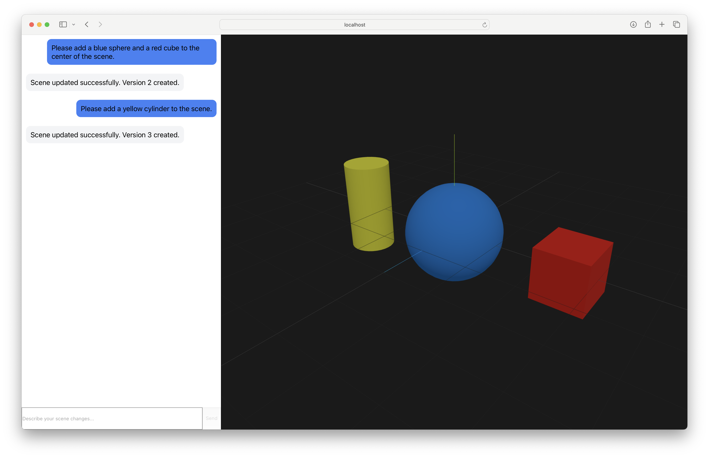
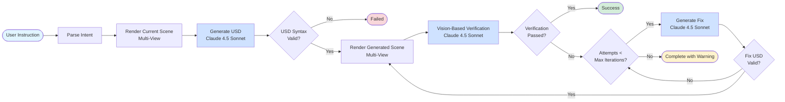

# CoScene: Interactive Multi-Agent 3D Scene Editing via Vision-Language Models

- **Authors:** Kshitij Chandna (kc3930), Jack Harris (jh4853)
- **Course:** COMSE6998 - LLMs and Generative AI
- **Institution:** Columbia University

## Overview

CoScene is a conversational 3D scene editing system that enables natural language manipulation of USD (Universal Scene Descriptor) scenes using Vision-Language Models (VLMs). The system combines LangGraph agent orchestration with Claude 3.5 Sonnet to provide an intuitive interface for creating and modifying 3D scenes through chat-based interaction.



### Key Features

- **Natural Language Editing**: Describe scene changes in plain English
- **Real-time 3D Visualization**: See your edits rendered immediately in Three.js
- **Agent Orchestration**: LangGraph-powered workflow with automated verification loops
- **WebSocket Streaming**: Real-time progress updates during scene generation
- **Multi-View Rendering**: View scenes from multiple camera angles
- **Version History**: Track and rollback scene changes
- **Interactive Chat**: Powered by assistant-ui for rich conversational experience

## Architecture

The system consists of four main components:

### Agent Framework
- **Agent Pipeline**: LangGraph workflow orchestrating USD generation, rendering, and verification
- **USD Manipulation**: Procedural scene generation and editing using USD Python API
- **Blender Integration**: Headless rendering service for multi-view visualization



### Backend (FastAPI + LangGraph)
- **PostgreSQL Database**: Session management, conversation history, and scene versioning
- **WebSocket API**: Real-time streaming updates to frontend

### Frontend (React + Three.js)
- **Split-View Interface**: Chat panel for interaction, 3D viewport for visualization
- **assistant-ui Integration**: Rich message rendering with custom components
- **Vanilla Three.js**: Direct scene manipulation and rendering
- **Real-time Updates**: WebSocket connection for streaming agent progress
- **Session Management**: Persistent editing sessions with version history

### Evaluation Framework
- **Synthetic Dataset Generation**: Procedurally generated test cases with ground truth
- **Quantitative Metrics**: Structural, visual, and semantic evaluation metrics
- **Ablation Studies**: Framework for testing different model configurations
- **Automated Reporting**: HTML/Markdown reports with performance analysis

## Getting Started

To run the application, check out the developer documentation:
- **Backend README**: `coscene-backend/README.md`
- **Frontend README**: `coscene-frontend/README.md`

## Project Structure

```
CoScene/
├── coscene-backend/          # FastAPI backend service
│   ├── api/                  # REST and WebSocket endpoints
│   ├── agents/               # LangGraph agent workflows
│   ├── services/             # USD, rendering, storage services
│   ├── evaluation/           # Evaluation framework
│   └── docker/               # Docker configuration
├── coscene-frontend/         # React frontend application
│   ├── src/
│   │   ├── components/       # React components
│   │   ├── services/         # API and WebSocket clients
│   │   ├── hooks/            # Custom React hooks
│   │   └── utils/            # USD parsing and utilities
│   └── public/               # Static assets
└── figures/                  # Documentation assets
```

## Technology Stack

### Agent Framework
- **LangGraph** - Agent workflow orchestration
- **Claude 3.5 Sonnet** - Vision-Language Model for USD generation
- **USD (pxr)** - Universal Scene Descriptor manipulation
- **Blender** - Headless 3D rendering

### Backend
- **FastAPI** - Async web framework with WebSocket support
- **PostgreSQL 16** - Database with BYTEA for render storage

### Frontend
- **React 18** - UI framework with TypeScript
- **assistant-ui** - Chat interface with LocalRuntime
- **Three.js** - 3D scene rendering and visualization
- **Vite** - Build tool and development server
- **Tailwind CSS** - Styling framework

### Evaluation
- **scikit-image** - SSIM, MSE, PSNR metrics
- **matplotlib** - Visualization and plotting
- **pandas** - Data analysis and aggregation
