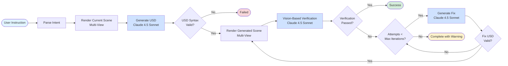

# Agents Module - LangGraph Scene Editor

Conversational 3D scene editing using **LangGraph** + **Claude 4.5 Sonnet**. Generates USD code from natural language prompts.

---

## Architecture

### LangGraph Workflow

